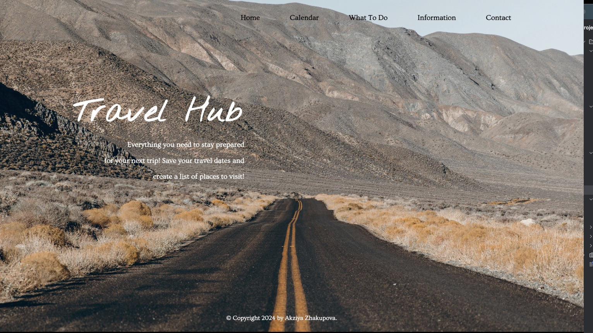
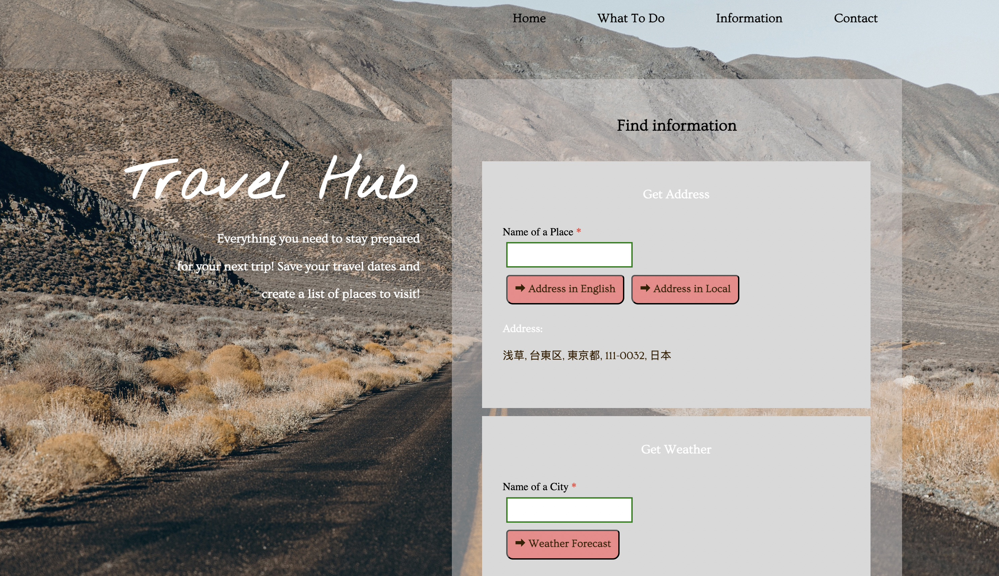
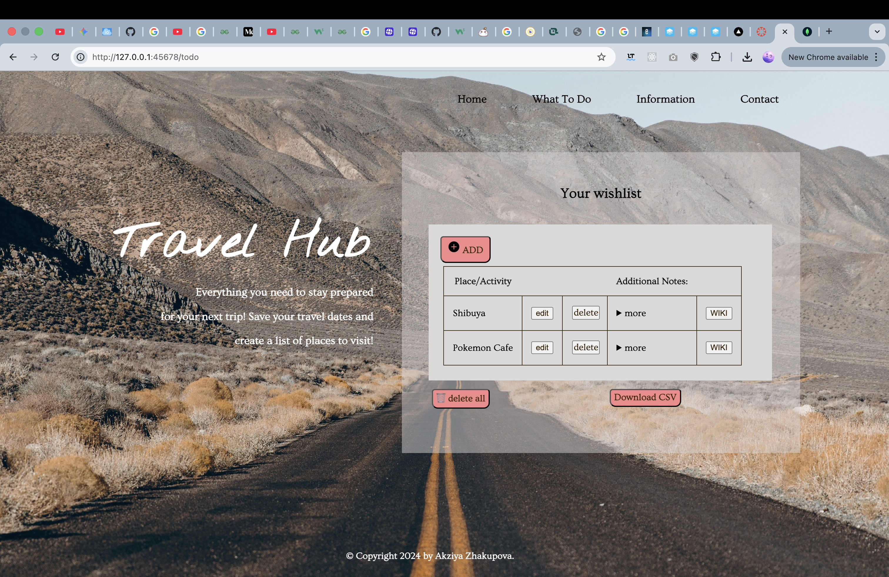

# Travel Hub 

**Everything you need to stay prepared for your next trip!** Save your travel dates and create a list of places to visit.

---

##  Project Overview
Travel Hub is a full-stack application that helps users organize their travel wishlists. It is built using a **decoupled microservices architecture**, meaning the main application communicates with independent "worker" services to fetch weather, location, and historical data.

##  Tech Stack
* **Framework:** Flask (Python)
* **Database:** MongoDB Atlas (NoSQL)
* **Messaging:** ZeroMQ (REQ/REP Pattern)
* **APIs:** Weatherbit, Wikipedia, GeoPy (Nominatim)

##  Microservices Architecture
The system is divided into a **Hub** and several **Spokes** to ensure scalability:

* **Flask App (The Hub):** Manages the UI and MongoDB data.
* **Weather Service (getWeather.py):** Listens on port `5559` for city-specific forecasts.
* **Location Service (findLocation.py):** Listens on port 5557 to provide address details via Geopy.
* **CSV Service (csv_convert.py):** Handles the logic for exporting the wishlist to downloadable files.
* **Wiki Service (informationLink.py):** Connects to the Wikipedia API to provide background on travel destinations.


## Features
* **Wishlist:** Full CRUD functionality (Create, Read, Update, Delete) for travel spots. Data is securely stored and retrieved using MongoDB Atlas, ensuring persistence across sessions.
* **Live Weather:** Provides real-time, 7-day forecasts for any city entered by the user. This feature leverages the Weatherbit API via a dedicated ZMQ microservice to keep the main application lightweight.
* **Smart Search:** Automatically fetches historical and cultural summaries for added places. This is powered by the Wikipedia API, allowing users to learn more about their destinations instantly.
* **Export:** Allows users to download their entire wishlist as a .csv file. This is handled by a separate ZMQ worker to demonstrate background data processing

## Installation

1. **Clone the repo:**
   ```bash
   git clone git@github.com:akziyaZH/Microservices-Project-CS362.git
   cd Microservices-Project-CS362
   ```
2. **Configure Environment Variables**
    ```
    # Database
    MONGO_URI=your_mongodb_atlas_uri
    
    # API Keys
    WEATHERBIT_API_KEY=your_weatherbit_key
    
    # Service Ports
    APP_PORT=45678
   WIKI_SERVICE_PORT=5555
    LOCATION_SERVICE_PORT=5556
    CSV_SERVICE_PORT=5558
    WEATHER_SERVICE_PORT=5559
    ```

## How to Run

The entire system is containerized. You do not need to install Python or dependencies locally if you have Docker installed.

**Start the System**
```
docker-compose up --build
```
*The application will be accessible at http://localhost:45678*

**Stop the System**
```
docker-compose down
```

## Project Gallery
|         Main Dashboard          |      Information & Weather       |
|:-------------------------------:|:--------------------------------:|
|      |  |

 Wishlist            
  